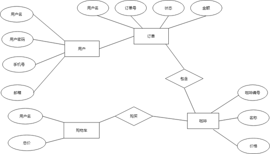
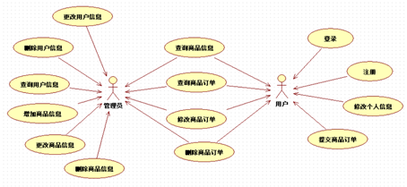
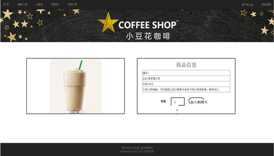
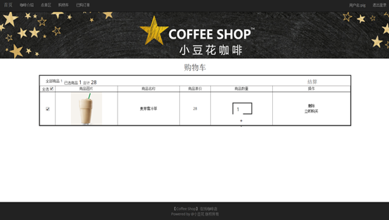
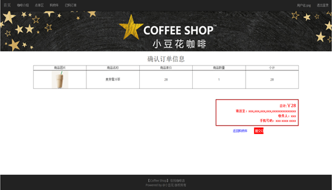
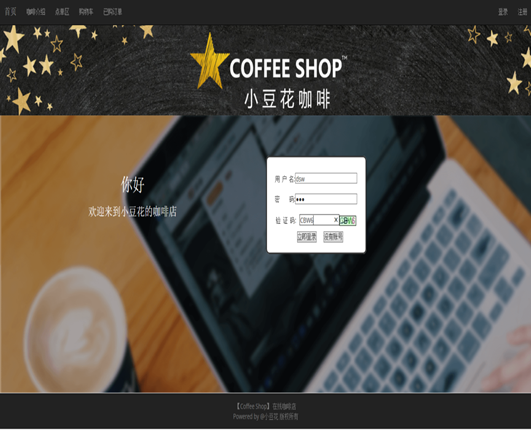
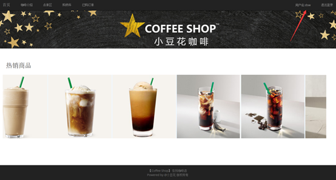

# 基于JavaWeb的网上咖啡店
这个基于JavaWeb的网上咖啡店系统的主要功能是为了给用户提供一个网络在线的咖啡购物平台。用户可以登录、注册系统，可以在系统中选择自己喜欢的咖啡产品并下单购买。

## 主要功能模块

- 登录功能：用户登录系统
- 注册功能：用户注册登录系统的账号
- 咖啡点单功能：用户浏览咖啡信息并下单
- 购物车功能：存放用户加入的购物车的咖啡
- 下单功能：给用户结算放在购物车的咖啡

## 系统详细接口

## 主要用户界面
咖啡加入购物车及结算功能，进入咖啡详情页面，点击加入购物车按钮

购物车页面显示已经加入购物车的咖啡

点击立即购买按钮，就跳转去结算页面

## 登录演示
使用账号dsw登录账号

登录成功后，首页的右上角会显示登陆的用户名

## 总结
这个基于JavaWeb的网上咖啡店系统的主要功能是为了给用户提供一个网络在线的咖啡购物平台。用户可以登录、注册系统，可以在系统中选择自己喜欢的咖啡产品并下单购买。

